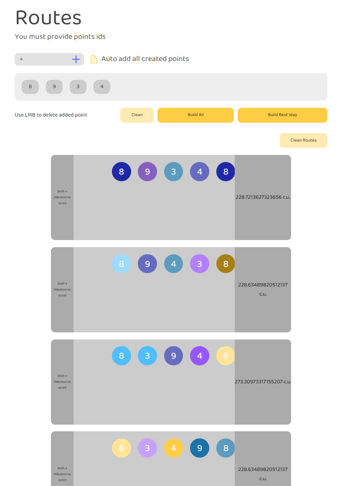
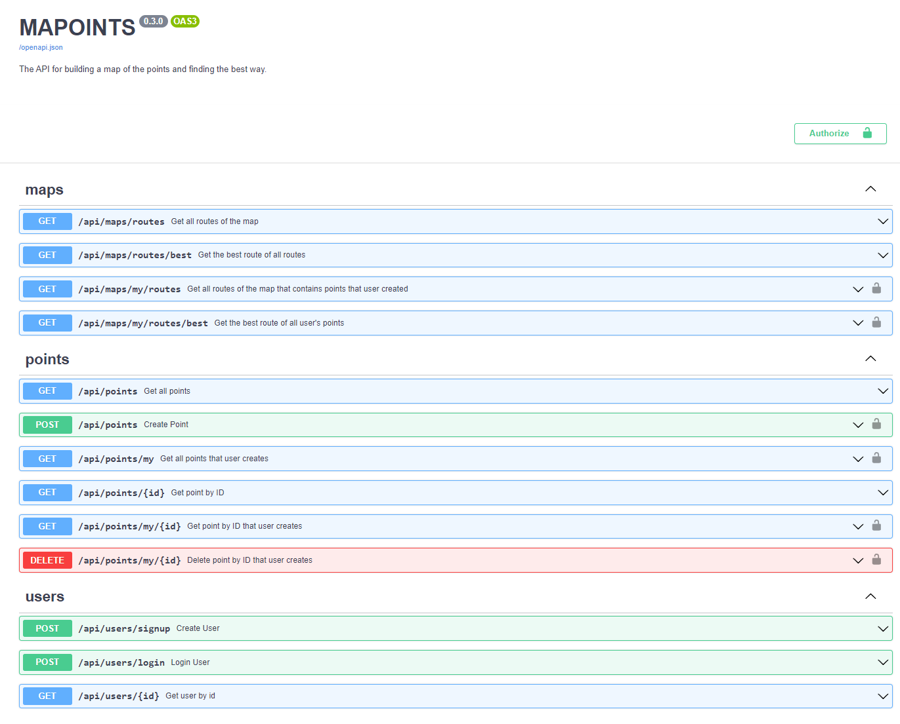
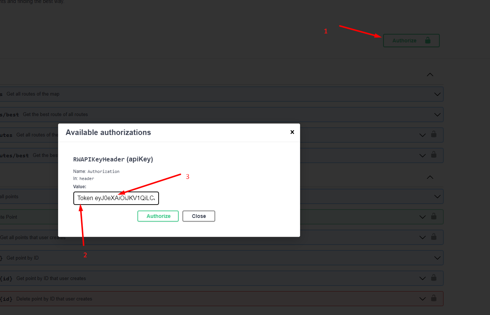
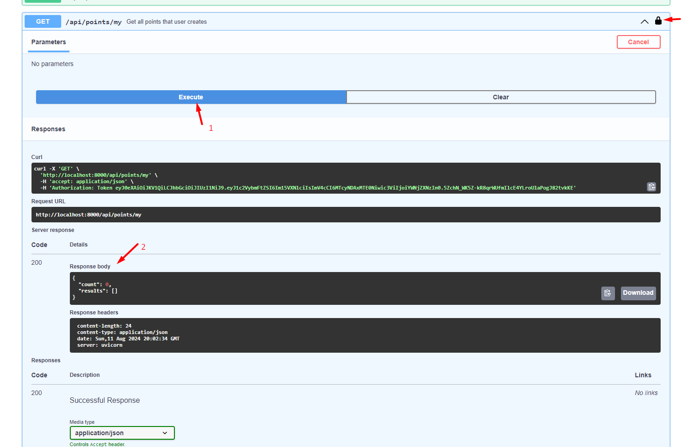

# MAPOINTS
___
The API for building a map of the points and finding the best way of it.


You are free to create the required number of points with `X` and `Y` coordinates and 
find either the best path among those specified, or look at all possible variations of paths.

In this implementation, the optimal path is found using an algorithm for traversing 
all possible paths (with complexity `O(n!)`).

## Tech
- Python ^3.7 
    - [FastAPI](https://fastapi.tiangolo.com/)
- Poetry 1.1.15 + Docker

> You are able to import Postman collection from the file in the root project directory: `MAPOINTS.postman_collection.json`, but
> probably you don't want to use it due to this project supported with **interactive** `Swagger` board (take a look below).

## Launch Guide
First you need to clone this repo:
```
git clone https://github.com/AlexandrChikur/mapoints.git
cd mapoints/
```
Create the .env file with data that contains in .env.example
in **project root directory**:
```bash
cp .env.example .env
```
Then, you able to set `debug` mode to `True` via editing just created `.env` file:
```bash
# ./.env
DEBUG=True  # Change this line
...
```
And then you free to launch `mapoints` *dev stand* in a single command:
```
docker-compose up --build
```

## Overview
___
After an application has been started successfully you will see the log something like that:
```
[+] Running 3/0
 ✔ Container mapoints-db-1     Created                                                                                                                                                           0.0s 
 ✔ Container mapoints-app-1    Created                                                                                                                                                           0.0s 
 ✔ Container mapoints-front-1  Created                                                                                                                                                           0.0s 
Attaching to mapoints-app-1, mapoints-db-1, mapoints-front-1
mapoints-db-1     | 2024-08-11 19:25:23.255 UTC [1] LOG:  listening on IPv4 address "0.0.0.0", port 5432
mapoints-db-1     | 2024-08-11 19:25:23.255 UTC [1] LOG:  listening on IPv6 address "::", port 5432
mapoints-db-1     | 2024-08-11 19:25:23.261 UTC [1] LOG:  listening on Unix socket "/var/run/postgresql/.s.PGSQL.5432"
mapoints-db-1     | 2024-08-11 19:25:23.293 UTC [19] LOG:  database system was shut down at 2024-08-11 19:19:33 UTC
mapoints-db-1     | 2024-08-11 19:25:23.322 UTC [1] LOG:  database system is ready to accept connections
mapoints-app-1    | Waiting for DB: <postgres>
mapoints-app-1    | <postgres> started
mapoints-db-1     | 2024-08-11 19:25:23.529 UTC [26] LOG:  incomplete startup packet
mapoints-app-1    | INFO:     Will watch for changes in these directories: ['/app']
mapoints-app-1    | INFO:     Uvicorn running on http://0.0.0.0:8000 (Press CTRL+C to quit)
mapoints-app-1    | INFO:     Started reloader process [8] using statreload
mapoints-front-1  | 
mapoints-front-1  | > mapoints@0.1.0 start
mapoints-front-1  | > node server.js
mapoints-front-1  | 
mapoints-front-1  | Server started
mapoints-app-1    | INFO:     Started server process [10]
mapoints-app-1    | INFO:     Waiting for application startup.
mapoints-app-1    | 2024-08-11 19:25:25.702 | INFO     | app.db.events:connect_to_db:9 - Connecting to the postgresql://postgres:postgres@db:5432/postgres
mapoints-app-1    | 2024-08-11 19:25:25.742 | INFO     | app.db.events:connect_to_db:11 - Connection established successfully
mapoints-app-1    | INFO:     Application startup complete.
```

And application will be available on:
### Frontend
* Host: `http://localhost:8001/`

You able to Sign Up first there in then Sign In.
After that you can create your own points or use the points which created by other users:

And then build your routes:


### Backend
* Host: `http://localhost:8001/api/`
* Docs: `http://localhost:8001/docs/`
You able to test an API queries straight from Swagger API board:


First, you need to sign up and take the token (or login with existed credentials):


Set authorize header:


And send API request for private (or non-private) endpoints:
